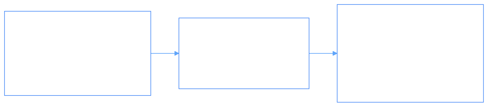

# Phient UI (`@pui/components`) Architectural Roadmap

> _Milestone roadmap for Phient UI component library, Palantir Blueprint parity, and standalone applications._

---

## 1. Roadmap Milestones

---

## 2. Milestone Breakdown

### Phase 1: Core Foundation & Rebranding (Completed)
- [x] Rebrand from `@vvid/ui` to `@pui/components`
- [x] Purge domain commerce/cart state from core library
- [x] Implement Palantir Blueprint standard design tokens (`--phi-*`)
- [x] Build `PuiProvider` with Foundry, Blueprint, Emerald, and Midnight presets
- [x] Create `Tree`, `Tag`, `Callout`, `NonIdealState`, `Switch`, `FormGroup`, `ProgressBar`
- [x] Remove legacy `.storybook` in favor of `apps/docs-app`

### Phase 2: Standalone Applications (`apps/`) (Completed)
- [x] `apps/docs-app`: Interactive component playground, live props inspector, and code examples
- [x] `apps/demo-app`: Enterprise operations showcase with live agent swarms, telemetry drawer, and ontology trees
- [x] `apps/landing-app`: Design system landing showcase

### Phase 3: Advanced Data Structures & Virtualization (Upcoming)
- [ ] `@pui/components-table`: Virtualized spreadsheet table supporting 100k+ rows with column pinning and sorting
- [ ] `@pui/components-select`: Filterable `Select`, `MultiSelect`, `Suggest`, and `Omnibar`
- [ ] `@pui/components-graph`: Continuous phase manifold & Topos ontology graph visualizer
