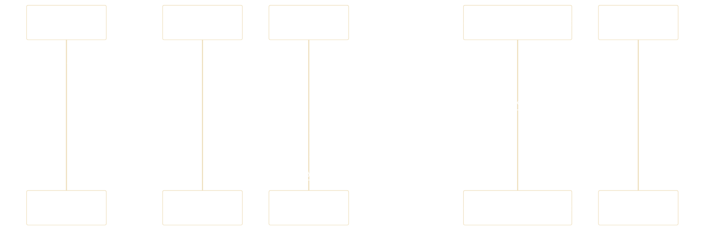

# Phient UI (`@pui/components`) Interaction & Navigation Flows

> _User interaction flows, theme switching lifecycle, and overlay management._

---

## 1. Theme Switching Lifecycle



---

## 2. Modal & Drawer Overlay Lifecycle

```mermaid
%%{init: {'theme': 'base', 'themeVariables': {'background': 'transparent', 'mainBkg': 'transparent', 'nodeBorder': '#3b82f6', 'clusterBkg': 'transparent', 'clusterBorder': '#475569', 'lineColor': '#60a5fa', 'textColor': '#ffffff', 'primaryTextColor': '#ffffff', 'nodeTextColor': '#ffffff', 'edgeLabelBackground': '#0f172a'}}}%%
sequenceDiagram
    participant User
    participant Component as Action Button
    participant Overlay as Dialog / Drawer
    participant Backdrop as Portal Backdrop

    User->>Component: Click Trigger
    Component->>Overlay: isOpen = true
    Overlay->>Backdrop: Mount Portal & Lock Scroll
    User->>Backdrop: Click Outside / Escape Key
    Backdrop->>Overlay: onClose()
    Overlay->>Component: isOpen = false
    Overlay-->>User: Smooth CSS Transition Out
```
