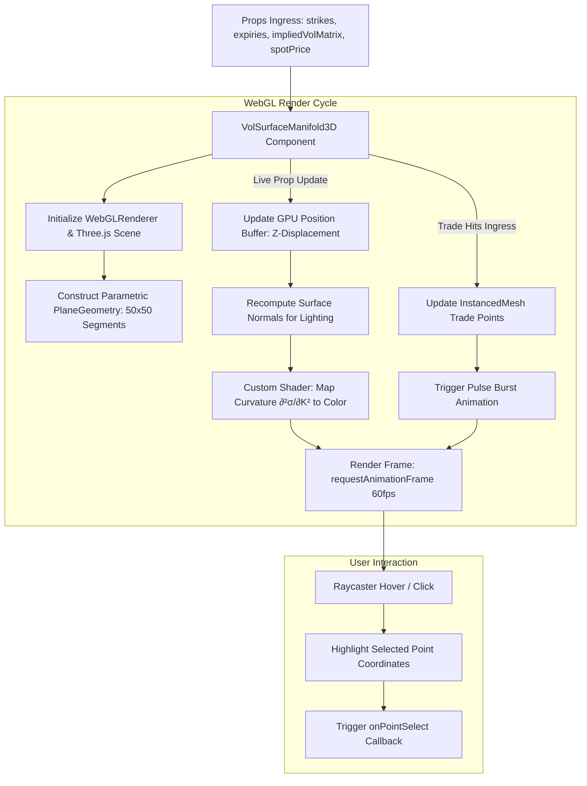

# SPEC-001: 3D Volatility Surface Manifold Component

## 1. Executive Summary & Theoretical Grounding

> **Deep Learning Concept Reference (Chollet DL Book §14.1)**:
> *"Deep learning is geometry: high-dimensional continuous manifolds mapping inputs to targets. Visualizing these surfaces allows practitioners to immediately spot geometric anomalies, local discontinuities, and arbitrage violations."*

`VolSurfaceManifold3D` renders continuous options implied volatility manifolds in Three.js / WebGL, providing quantitative operators with real-time $60\text{ fps}$ spatial exploration of strike skew, term structure curvature, and trade fills.

---

## 2. Architectural Hierarchy Tree

```
puijs::components::3d::VolSurfaceManifold3D
├── Three.js WebGL Scene Architecture
│   ├── PerspectiveCamera (FOV: 45°, Near: 0.1, Far: 1000)
│   ├── OrbitControls (Constrained polar angles 15°–85° to prevent underside flipping)
│   ├── Parametric Plane Mesh: PlaneGeometry(width, height, segmentsX, segmentsY)
│   └── Custom Fragment & Vertex Shaders (Curvature & Butterfly Density Heatmap)
├── Geometric Interpolation & Vertex Displacement
│   ├── Log-Moneyness & Sqrt-Time Coordinate Normalizer
│   ├── GPU Buffer Vertex Attribute Updater: position.setZ(index, iv * scale)
│   └── Normal Vector Recalculator: geometry.computeVertexNormals()
├── Real-Time Trade Point Projector
│   ├── InstancedMesh Sphere Geometry (Green for Buys, Red for Sells)
│   ├── Splatter Particle Shader (Brief glowing burst upon new fill event)
│   └── Hover Tooltip Raycaster (Extracts strike, expiry, IV, and size on mouseover)
└── Slicing Plane & Curve Overlay Tool
    ├── Term Structure Slicing Plane (Constant strike cross-section)
    └── Strike Skew Slicing Plane (Constant expiry cross-section)
```

---

## 3. Component Interaction & Execution Flow



---

## 4. Technical Specification & Data Structures

### 4.1 Component Props Specification

| Prop Name | TypeScript Type | Required | Default | Description |
| :--- | :--- | :--- | :--- | :--- |
| `strikes` | `number[]` | Yes | — | Sorted array of option strike prices |
| `expiries` | `number[]` | Yes | — | Sorted array of expiry times (in years) |
| `impliedVolMatrix` | `number[][]` | Yes | — | 2D matrix of implied volatility values $[0.05, 3.0]$ |
| `spotPrice` | `number` | Yes | — | Current underlying spot price for moneyness calculation |
| `tradeHits` | `TradeHit[]` | No | `[]` | Stream of recent trade fills to project on the surface |
| `width` | `number \| string` | No | `"100%"` | Container width in pixels or percentage |
| `height` | `number \| string` | No | `500` | Canvas height in pixels |
| `colorMap` | `'viridis' \| 'plasma' \| 'cyan-magenta'` | No | `'viridis'` | Shader colormap palette |
| `onPointSelect` | `(strike: number, expiry: number, iv: number) => void` | No | `undefined` | Interactive click callback |

---

## 5. TypeScript Component Signatures

```typescript
import React from 'react';

export interface TradeHit {
  strike: number;
  expiry: number;
  price: number;
  side: 'buy' | 'sell';
  timestamp: number;
}

export interface VolSurface3DProps {
  strikes: number[];
  expiries: number[];
  impliedVolMatrix: number[][];
  spotPrice: number;
  tradeHits?: TradeHit[];
  width?: number | string;
  height?: number | string;
  colorMap?: 'viridis' | 'plasma' | 'cyan-magenta';
  onPointSelect?: (strike: number, expiry: number, iv: number) => void;
}

export const VolSurfaceManifold3D: React.FC<VolSurface3DProps> = ({
  strikes,
  expiries,
  impliedVolMatrix,
  spotPrice,
  tradeHits = [],
  width = '100%',
  height = 500,
  colorMap = 'viridis',
  onPointSelect,
}) => {
  // Implementation manages Three.js WebGL canvas context, shaders, and animations
  return <div style={{ width, height, position: 'relative' }} className="vol-surface-manifold-3d" />;
};
```

---

## 6. Verification & Test Criteria

1. **WebGL Memory Disposal**: Unmounting the component must call `geometry.dispose()`, `material.dispose()`, and `renderer.dispose()` with zero lingering GPU memory allocations.
2. **Smooth 60fps Animation**: Live updating the surface matrix at $10\text{ Hz}$ while rotating the camera must maintain $\ge 60\text{ fps}$ without frame drops.
3. **Raycast Hit Precision**: Clicking anywhere on the manifold surface must resolve the exact (strike, expiry, IV) coordinate tuple and invoke `onPointSelect` within $<5\text{ms}$.
4. **Arbitrage Violation Visualization**: Areas with negative butterfly density (arbitrage) must automatically render with pulsating high-contrast warning stripes in the custom shader.
