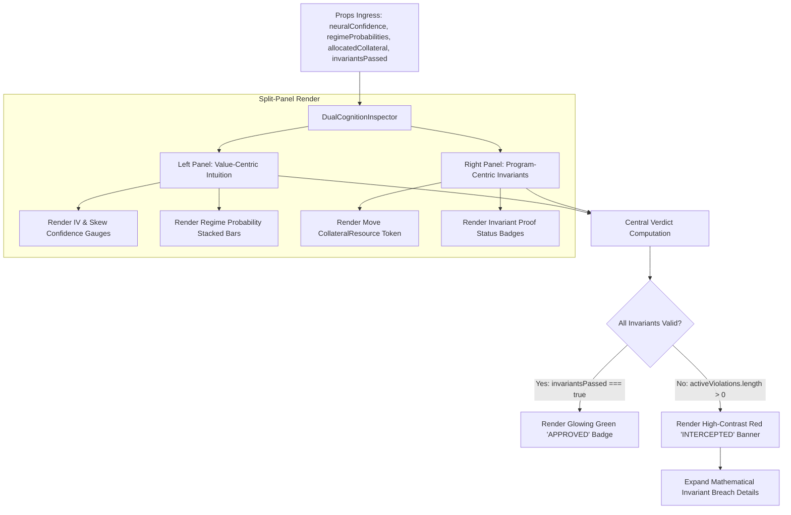

# SPEC-003: Dual-Cognition Inspector Component

## 1. Executive Summary & Theoretical Grounding

> **Deep Learning Concept Reference (Chollet DL Book §14.4)**:
> *"Making dual-cognition systems transparent requires showing both the continuous intuition layer and the discrete rule-based verification layer simultaneously. Operators need to see why a neural model proposed an action, and exactly which symbolic invariants validated or rejected it."*

`DualCognitionInspector` provides a dense, split-panel diagnostic view rendering continuous neural predictions (left) alongside discrete Move linear resource proofs and risk limits (right).

---

## 2. Architectural Hierarchy Tree

```
puijs::components::diagnostics::DualCognitionInspector
├── Value-Centric Intuition Panel (Left View)
│   ├── Continuous Implied Volatility Forecast Gauge
│   ├── Greeks Sensitivity Sliders: Delta, Gamma, Vega, Theta
│   ├── Market Regime Probability Distribution Bars: LowVol / MedVol / HighVol / Dislocated
│   └── Neural Prediction Confidence Ring
├── Program-Centric Symbolic Verification Panel (Right View)
│   ├── Move CollateralResource Linear Token Balance
│   │   ├── Allocated Margin Token Gauge
│   │   └── Available Margin Vault Gauge
│   ├── Pre-Trade Delta Bound Invariant: Total Delta ≤ MaxDelta
│   ├── Notional Limit Invariant: Order Notional ≤ MaxNotional
│   └── Invariant Status Badges (Green: Verified Proof, Red: Invariant Violation)
└── Central Consensus Verdict Banner
    ├── Action Verdict: Approved / Blocked / Scaled
    ├── Mathematical Deficit Breakdown (Displayed on Rejection)
    └── Historical Decision Latency Display (Nanoseconds turnaround)
```

---

## 3. Component Interaction & Execution Flow



---

## 4. Technical Specification & Data Structures

### 4.1 Component Props Specification

| Prop Name | TypeScript Type | Required | Description |
| :--- | :--- | :--- | :--- |
| `neuralConfidence` | `number` | Yes | Model confidence score $[0.0, 1.0]$ |
| `impliedVolExpected` | `number` | Yes | Continuous forecast implied volatility |
| `regimeProbabilities` | `RegimeProbs` | Yes | Probabilities across `lowVol, medVol, highVol, dislocated` |
| `allocatedCollateralUsd`| `number` | Yes | Active Move linear collateral token value |
| `availableCollateralUsd`| `number` | Yes | Unallocated collateral vault balance |
| `invariantsPassed` | `boolean` | Yes | Master verification boolean |
| `activeViolations` | `string[]` | Yes | List of active rule breach explanations |
| `lastDecisionTimeNs` | `number` | No | Execution decision duration in nanoseconds |

---

## 5. TypeScript Component Signatures

```typescript
import React from 'react';

export interface RegimeProbs {
  lowVol: number;
  medVol: number;
  highVol: number;
  dislocated: number;
}

export interface DualCognitionProps {
  neuralConfidence: number;
  impliedVolExpected: number;
  regimeProbabilities: RegimeProbs;
  allocatedCollateralUsd: number;
  availableCollateralUsd: number;
  invariantsPassed: boolean;
  activeViolations: string[];
  lastDecisionTimeNs?: number;
  className?: string;
}

export const DualCognitionInspector: React.FC<DualCognitionProps> = ({
  neuralConfidence,
  impliedVolExpected,
  regimeProbabilities,
  allocatedCollateralUsd,
  availableCollateralUsd,
  invariantsPassed,
  activeViolations,
  lastDecisionTimeNs,
  className,
}) => {
  return (
    <div className={`dual-cognition-inspector ${className || ''}`}>
      {/* Renders split grid with continuous left panel and discrete right panel */}
    </div>
  );
};
```

---

## 6. Verification & Test Criteria

1. **Violation Highlighting**: Passing `activeViolations = ["Delta limit exceeded by 0.05 BTC"]` must render the exact violation message in high-contrast red alert styling.
2. **Move Collateral Conservation**: The sum of allocated + available collateral in the UI must match total account equity without rounding artifacts.
3. **Sub-1ms DOM Update**: Re-rendering component state on $10\text{ Hz}$ tick updates must execute in $<1.0\text{ms}$ DOM paint time.
4. **Accessible Screen Reader Tags**: All badges and gauges include `aria-label` attributes describing continuous confidence and invariant states.
