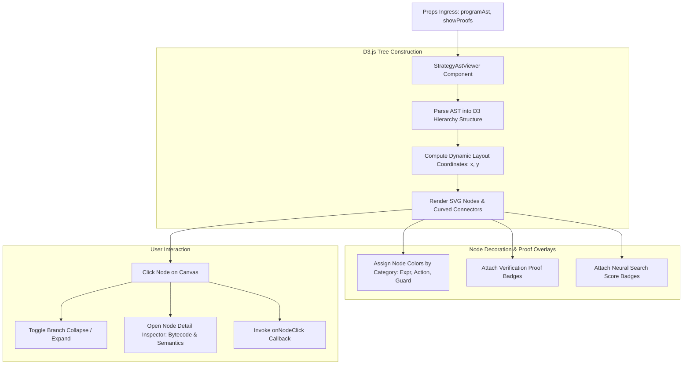

# SPEC-004: Strategy DSL AST Tree Viewer & Proof Annotations

## 1. Executive Summary & Theoretical Grounding

> **Deep Learning Concept Reference (Chollet DL Book §14.5A)**:
> *"Program synthesis generates candidate programs as abstract syntax trees (ASTs). Visualizing these synthesized trees alongside their formal verification proofs makes algorithmic generation interpretable, debuggable, and auditable."*

`StrategyAstViewer` renders synthesized Phixum Strategy DSL programs as interactive, collapsible hierarchical syntax trees in SVG / D3.js with formal type safety proof badges.

---

## 2. Architectural Hierarchy Tree

```
puijs::components::dsl::StrategyAstViewer
├── Hierarchical Tree Layout Engine (D3.js / SVG)
│   ├── Node Coordinates: d3.tree() / d3.hierarchy()
│   ├── Smooth Curved Link Generators: d3.linkHorizontal()
│   ├── Collapsible Subtree Toggles: Expand / collapse child AST branches
│   └── Zoom & Pan Canvas (d3.zoom context)
├── Syntax AST Node Visualizers
│   ├── Expression Nodes (Expr): Market prices, Greeks, arithmetic operators
│   ├── Action Nodes (Action): Limit orders, slicing routines, hedge solvers
│   ├── Condition Nodes (Condition): Comparators, boolean logic, timers
│   └── Guard Nodes (Guard): Pre-execution safety invariants
├── Formal Verification Proof Badges
│   ├── Bounded Termination Proof Badge (Confirms finite step execution)
│   ├── Collateral Conservation Proof Badge (Confirms Move single-spend)
│   └── Neural Heuristic Pruning Score Badge (MCTS search potential)
└── Interactive Detail Inspector Modal
    ├── Node Bytecode Opcode Breakdown
    ├── Live Variable Evaluation Sandbox
    └── JSON / YAML AST Export Button
```

---

## 3. Component Interaction & Execution Flow



---

## 4. Technical Specification & Data Structures

### 4.1 Component Props Specification

| Prop Name | TypeScript Type | Required | Default | Description |
| :--- | :--- | :--- | :--- | :--- |
| `programAst` | `StrategyProgramAST` | Yes | — | Complete serialized AST of synthesized strategy |
| `showProofs` | `boolean` | No | `true` | Toggles display of formal verification proof badges |
| `highlightNodeId` | `string` | No | `undefined` | ID of node to pulse / highlight on canvas |
| `width` | `number \| string` | No | `"100%"` | Container width in pixels or percentage |
| `height` | `number \| string` | No | `600` | Container height in pixels |
| `onNodeClick` | `(nodeId: string, nodeType: string) => void` | No | `undefined` | Node selection callback |

---

## 5. TypeScript Component Signatures

```typescript
import React from 'react';

export interface AstNodeItem {
  id: string;
  type: 'Expr' | 'Action' | 'Condition' | 'Guard';
  label: string;
  parameters?: Record<string, any>;
  heuristicScore?: number;
  verifiedProof?: string;
  children?: AstNodeItem[];
}

export interface StrategyProgramAST {
  name: string;
  rootNode: AstNodeItem;
  maxExecutionTimeNs: number;
  compilationTimestamp: number;
}

export interface AstViewerProps {
  programAst: StrategyProgramAST;
  showProofs?: boolean;
  highlightNodeId?: string;
  width?: number | string;
  height?: number | string;
  onNodeClick?: (nodeId: string, nodeType: string) => void;
}

export const StrategyAstViewer: React.FC<AstViewerProps> = ({
  programAst,
  showProofs = true,
  highlightNodeId,
  width = '100%',
  height = 600,
  onNodeClick,
}) => {
  return (
    <div style={{ width, height, position: 'relative' }} className="strategy-ast-tree-viewer">
      {/* SVG canvas rendered via D3 hierarchy layout */}
    </div>
  );
};
```

---

## 6. Verification & Test Criteria

1. **Large Tree Layout Scalability**: Rendering an AST with up to 150 nodes must lay out and paint in $<20\text{ms}$ without UI thread freezing.
2. **Interactive Node Collapse**: Clicking a collapsed node must animate child nodes expanding in $<150\text{ms}$ with smooth transition curves.
3. **Formal Proof Badge Integrity**: When `showProofs = true`, every `Guard` and `Action` node must display its corresponding static proof badge.
4. **SVG Export Fidelity**: Exporting the tree canvas as SVG must produce valid vector output preserving all styles and labels.
