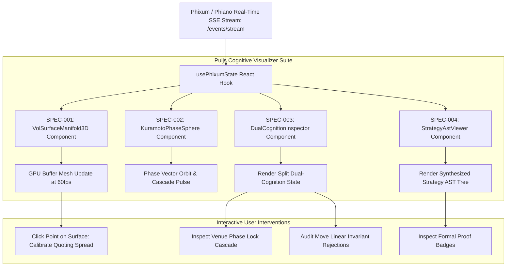

# Puijs Cognitive Specifications: Chapter 14 3D Visualization & Diagnostic UI

## 1. Executive Overview

This directory contains the formal component specifications applying the principles from **Chapter 14 ("Conclusions") of François Chollet's *Deep Learning with Python* (2nd Edition)** to the Puijs industrial React design system and 3D cognitive visualization library:

| Spec ID | Specification Document | Core Chapter 14 Mechanism | Target Components | Primary Visual Invariant |
| :--- | :--- | :--- | :--- | :--- |
| **SPEC-001** | [`001_vol_surface_3d_manifold.md`](./001_vol_surface_3d_manifold.md) | **14.1 Geometric Manifolds (Continuous Spline Surface)** | `src/components/3d/VolSurfaceManifold3D.tsx` | WebGL 60fps parametric mesh rendering with curvature shaders |
| **SPEC-002** | [`002_kuramoto_phase_sphere.md`](./002_kuramoto_phase_sphere.md) | **14.2 Extreme Generalization (Kuramoto Bloch Sphere)** | `src/components/3d/KuramotoPhaseSphere.tsx` | 3D unit sphere tracking order parameter $R(t)$ & cascade alert |
| **SPEC-003** | [`003_dual_cognition_inspector.md`](./003_dual_cognition_inspector.md) | **14.4 Dual-Cognition (Continuous vs Discrete Invariants)**| `src/components/diagnostics/DualCognitionInspector.tsx` | Split-view dashboard showing neural confidence vs Move linear logic |
| **SPEC-004** | [`004_strategy_ast_tree_viewer.md`](./004_strategy_ast_tree_viewer.md) | **14.5A Program Synthesis (Interactive AST Tree & Proofs)** | `src/components/dsl/StrategyAstViewer.tsx` | Collapsible D3/SVG syntax tree with static type safety badges |

---

## 2. Global Cognitive UI Hierarchy

```
Puijs Cognitive Component Ecosystem
├── Layer 1: 3D Geometric Manifold Visualizers (SPEC-001)
│   ├── Three.js WebGL Canvas Context & Shader Material Pipeline
│   ├── Parametric Spline Mesh: (Strike, Expiry, ImpliedVol) ──► MeshGeometry
│   ├── Dynamic Curvature Shader (Butterfly Risk-Neutral Density ∂²σ/∂K²)
│   ├── Live Trade Splatter Projector (Projects fills directly on the manifold)
│   ├── Slicing Plane Tool: Strike Skew & Term Structure Curve Overlays
│   └── Constrained OrbitControls with Smooth Damping
├── Layer 2: Kuramoto Phase Sphere Visualizers (SPEC-002)
│   ├── Unit Sphere (Bloch / Poincaré representation) in 3D Space
│   ├── Venue Orbital Rings & Phase Markers: θ_j(t) on Equator
│   ├── Global Order Vector Arrow: R(t) * exp(i * Ψ(t)) from origin to surface
│   ├── Dynamic Color Ramp: Cyan (Nominal) ──► Yellow ──► Glowing Red (Cascade)
│   └── Cascade Shockwave Shader Animation (Triggered on R(t) > 0.90)
├── Layer 3: Dual-Cognition Transparency Inspector (SPEC-003)
│   ├── Value-Centric Panel (Left): Continuous IV expectations & probability bars
│   ├── Program-Centric Panel (Right): Move CollateralResource balances & bounds
│   ├── Difference & Deviation Highlighter: Visualizes delta hedging gaps
│   ├── Central Consensus Verdict Gauge: Allowed / Intercepted with reasons
│   └── Nanosecond Latency Turnaround Metric
└── Layer 4: Program Synthesis Strategy AST Viewer (SPEC-004)
    ├── Interactive Collapsible Syntax Tree: Expr, Action, Condition, Guard
    ├── Neural Search Score Overlays (Node evaluation heuristics)
    ├── Formal Proof Badges (Bounded termination, single-spend collateral)
    ├── Interactive Node Opcode Breakdown Modal
    └── Hot-Reload Strategy Injector (Allows live bytecode testing in browser)
```

---

## 3. Global Data Flow & Component Pipeline



---

## 4. Technical Specification Matrix

| Component | Target File | Rendering Engine | Props Interface | Frame Budget | Primary Cognitive Role | Downstream Interaction |
| :--- | :--- | :--- | :--- | :--- | :--- | :--- |
| **`VolSurfaceManifold3D`** | `src/components/3d/VolSurfaceManifold3D.tsx` | Three.js / WebGL | `VolSurface3DProps` | $16.6\text{ms}$ (60fps) | Value-centric manifold intuition | Manifold point selection |
| **`KuramotoPhaseSphere`** | `src/components/3d/KuramotoPhaseSphere.tsx` | Three.js / WebGL | `KuramotoSphereProps`| $16.6\text{ms}$ (60fps) | Extreme OOD synchrony alerts | Cascade alert event hook |
| **`DualCognitionInspector`**| `src/components/diagnostics/DualCognitionInspector.tsx` | React DOM / SVG | `DualCognitionProps` | $100\text{ms}$ (10Hz) | Continuous vs discrete transparency | Invariant breach trace drilldown |
| **`StrategyAstViewer`** | `src/components/dsl/StrategyAstViewer.tsx` | D3.js / SVG | `AstViewerProps` | Event-Driven | Synthesized program inspection | Node opcode inspector |

---

## 5. Architectural Quality Attributes & Design Tokens

1. **Palantir Blueprint & EdX Paragon Aesthetic**: Dense high-information displays utilizing Tailwind/Vanilla CSS tokens, sleek dark modes, and subtle neon highlights (`#00f0ff`, `#7000ff`).
2. **GPU Memory Management**: Three.js geometries and materials are disposed explicitly on unmount to prevent WebGL context leaks.
3. **Responsive Glassmorphic Overlays**: Diagnostic overlays use `backdrop-filter: blur(12px)` and faint border gradients for a state-of-the-art developer experience.
4. **Accessible Keyboard Navigation**: All 3D canvases support orbit camera reset (`R`), zoom (`+/-`), and node navigation via standard keybindings.
5. **Zero Frame Stuttering**: Expensive layout computations (D3 tree layouts, mesh geometry generation) are memoized via `useMemo` hooks.

---

## 6. Glossary of Visual Cognitive Components

| Component | Description | Operator Benefit |
| :--- | :--- | :--- |
| **VolSurfaceManifold3D** | Interactive 3D continuous volatility manifold with real-time curvature shading | Instant visual inspection of volatility skew and butterfly arbitrage |
| **KuramotoPhaseSphere** | 3D Bloch sphere projecting cross-venue oscillator phase alignments | Real-time visual alert for cross-venue flash crash liquidation cascades |
| **DualCognitionInspector** | Side-by-side display of continuous neural scores alongside discrete Move tokens | Transparent auditability of algorithmic trading actions before dispatch |
| **StrategyAstViewer** | Interactive hierarchical tree rendering synthesized strategy execution ASTs | Formal verification inspection and debugging of synthesized programs |
